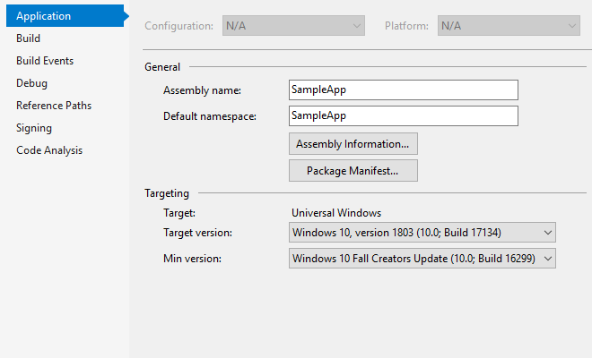

# Update from HamburgerMenu to NavigationView in MVVM Basic
If you have an UWP project created with WTS with project type **NavigationPane** and framework **MVVM Basic**  please follow these steps to update to NavigationView:

## 1. Update min target version in project properties
NavigationView is a Fall Creators Update control, to start using it in your project is neccessary that you set FCU as min version.


## 2. Update ShellPage.xaml
The updated ShellPage will include the NavigationView and add the MenuItems directly in Xaml. The NavigationViewItems include an extension property that contains the target page type to navigate in the frame.

### XAML code you will have to remove:
 - **xmln namespaces** for fcu, cu, controls and vm (viewmodels).
 - DataTemplate **NavigationMenuItemDataTemplate** in Page resources.
 - **HamburgerMenu** control.

### XAML code you will have to add:
- **namespaces**: xmlns:helpers="using:myAppNamespace.Helpers" and xmlns:views="using:myAppNamespace.Views"
 - **NavigationView** control.
 - **MenuItems** inside of the NavigationView.
 - **HeaderTemplate** inside of the NavigationView.

 The resulting code should look like this:

```xml
<Page
    x:Class="SampleApp.Views.ShellPage"
    xmlns="http://schemas.microsoft.com/winfx/2006/xaml/presentation"
    xmlns:x="http://schemas.microsoft.com/winfx/2006/xaml"
    xmlns:d="http://schemas.microsoft.com/expression/blend/2008"
    xmlns:mc="http://schemas.openxmlformats.org/markup-compatibility/2006"
    xmlns:helpers="using:SampleApp.Helpers"
    xmlns:views="using:SampleApp.Views"
    xmlns:ic="using:Microsoft.Xaml.Interactions.Core"
    xmlns:i="using:Microsoft.Xaml.Interactivity"
    mc:Ignorable="d">

    <NavigationView
        x:Name="navigationView"
        SelectedItem="{x:Bind ViewModel.Selected, Mode=OneWay}"
        Header="{x:Bind ViewModel.Selected.Content, Mode=OneWay}"
        IsSettingsVisible="False"
        Background="{ThemeResource SystemControlBackgroundAltHighBrush}">
        <NavigationView.MenuItems>
            <!--
            TODO WTS: Change the symbols for each item as appropriate for your app
            More on Segoe UI Symbol icons: https://docs.microsoft.com/windows/uwp/style/segoe-ui-symbol-font
            Or to use an IconElement instead of a Symbol see https://github.com/Microsoft/WindowsTemplateStudio/blob/master/docs/projectTypes/navigationpane.md
            Edit String/en-US/Resources.resw: Add a menu item title for each page
            -->
            <NavigationViewItem x:Uid="Shell_Main" Icon="Document" helpers:NavHelper.NavigateTo="views:MainPage" />
        </NavigationView.MenuItems>
        <NavigationView.HeaderTemplate>
            <DataTemplate>
                <TextBlock
                    Style="{StaticResource TitleTextBlockStyle}"
                    Margin="12,0,0,0"
                    VerticalAlignment="Center"
                    Text="{Binding}" />
            </DataTemplate>
        </NavigationView.HeaderTemplate>
        <i:Interaction.Behaviors>
            <ic:EventTriggerBehavior EventName="ItemInvoked">
                <ic:InvokeCommandAction Command="{x:Bind ViewModel.ItemInvokedCommand}" />
            </ic:EventTriggerBehavior>
        </i:Interaction.Behaviors>
        <Grid>
            <Frame x:Name="shellFrame" />
        </Grid>
    </NavigationView>
</Page>
```
## 3. Update ShellPage.xaml.vb
ShellViewModel will need the NavigationView instance (explained below), you will have to add it on initialization.

### VB code you will have to modify:
 - Add the navigationView control to ViewModel initialization.

The resulting code should look like this:
 ```vbnet
Public NotInheritable Partial Class ShellPage
    Inherits Page

    Public ReadOnly Property ViewModel As New ShellViewModel

    Public Sub New()
        Me.InitializeComponent()
        HideNavViewBackButton()
        DataContext = ViewModel
        ViewModel.Initialize(shellFrame, navigationView)
    End Sub

    Private Sub HideNavViewBackButton()
        If ApiInformation.IsApiContractPresent("Windows.Foundation.UniversalApiContract", 6) Then
            navigationView.IsBackButtonVisible = NavigationViewBackButtonVisible.Collapsed
        End if
    End Sub

End Class
```

## 4. Add NavHelper.vb

Add this extension class in the **Helpers** folder to the project. This allows the NavigationViewItems to contain a Type property that is used for navigation.
```vbnet
Public Class NavHelper

    Public Shared Function GetNavigateTo(item As NavigationViewItem) As Type
        Return CType(item.GetValue(NavigateToProperty), Type)
    End Function

    Public Shared Sub SetNavigateTo(item As NavigationViewItem, value As Type)
        item.SetValue(NavigateToProperty, value)
    End Sub

    Public Shared ReadOnly NavigateToProperty As DependencyProperty =
        DependencyProperty.RegisterAttached("NavigateTo", GetType(Type), GetType(NavHelper), New PropertyMetadata(Nothing))
End Class
```

## 5. Update ShellViewModel.vb
ShellViewModel's complexity will be reduced significantly, these are the changes that you will have to implement on the class.
### VB code you will have to remove:
 - private **const properties** for Visual States (Panoramic, Wide, Narrow).
 - **IsPaneOpen** observable property.
 - **DisplayMode** observable property.
 - **ObservableCollections** properties for **PrimaryItems** and **SecondaryItems**.
 - **OpenPaneCommand**.
 - **ItemSelectedCommand** and handler method **ItemSelected**.
 - **StateChangedCommand** and handler method **GoToState**.
 - **PopulateNavItems** method and method call from Initialize.
 - **InitializeState** method and method call from Initialize.
 - **Navigate** and **ChangeSelected** methods.

### VB code you will have to add _(implementation below)_:
 - **_navigationView** private property of type NavigationView.
 - **ItemInvokedCommand** and handler method **OnItemInvoked**.
 - **IsMenuItemForPageType** method.

### VB code you will have to update _(implementation below)_:
 - **Initialize** method.
 - **Frame_Navigated** method with the implementation below.

 The resulting code should look like this:
```vbnet
Public Class ShellViewModel
    Inherits Observable

    Private _navigationView As NavigationView

    Private _selected As NavigationViewItem

    Private _itemInvokedCommand As ICommand

    Public Property Selected As NavigationViewItem
        Get
            Return _selected
        End Get

        Set(value As NavigationViewItem)
            [Set](_selected, value)
        End Set
    End Property

    Public ReadOnly Property ItemInvokedCommand As ICommand
        Get
            If _itemInvokedCommand Is Nothing Then
                _itemInvokedCommand = New RelayCommand(Of NavigationViewItemInvokedEventArgs)(AddressOf OnItemInvoked)
            End If

            Return _itemInvokedCommand
        End Get
    End Property

    Public Sub Initialize(frame As Frame, navigationView As NavigationView)
        _navigationView = navigationView
        NavigationService.Frame = frame
        AddHandler NavigationService.Navigated, AddressOf Frame_Navigated
    End Sub

    Private Sub OnItemInvoked(args As NavigationViewItemInvokedEventArgs)
        Dim item = _navigationView.MenuItems.OfType(Of NavigationViewItem)().First(Function(menuItem) CStr(menuItem.Content) = CStr(args.InvokedItem))
        Dim pageType = TryCast(item.GetValue(NavHelper.NavigateToProperty), Type)
        NavigationService.Navigate(pageType)
    End Sub

    Private Sub Frame_Navigated(sender As Object, e As NavigationEventArgs)
        Selected = _navigationView.MenuItems.OfType(Of NavigationViewItem)().FirstOrDefault(Function(menuItem) IsMenuItemForPageType(menuItem, e.SourcePageType))
    End Sub

    Private Function IsMenuItemForPageType(menuItem As NavigationViewItem, sourcePageType As Type) As Boolean
        Dim pageType = TryCast(menuItem.GetValue(NavHelper.NavigateToProperty), Type)
        Return pageType = sourcePageType
    End Function
End Class
```

## 6. Remove ShellNavigationItem.vb
ShellNavigationItem is no longer used and you should remove it from the project.

## 7. Update XAML code for all pages
The pages do no longer need the TitlePage TextBlock and the Adaptive triggers, because the page title will be displayed on the NavigationView HeaderTemplate and the responsive behaviors will be added by NavigationView control.

### XAML code you will have to remove:
 - **xmln namespaces** for fcu and cu.
 - Textblock **TitlePage**
 - ContentArea Grid **RowDefinitions**
 - VisualStateManager **VisualStateGroups**.
 - **Grid.Row="1"** property  in the content Grid.

The resulting code should look like this:
```xml
<Page
    x:Class="SampleApp.Views.MainPage"
    xmlns="http://schemas.microsoft.com/winfx/2006/xaml/presentation"
    xmlns:x="http://schemas.microsoft.com/winfx/2006/xaml"
    xmlns:d="http://schemas.microsoft.com/expression/blend/2008"
    xmlns:mc="http://schemas.openxmlformats.org/markup-compatibility/2006"
    Style="{StaticResource PageStyle}"
    mc:Ignorable="d">
    <Grid
        x:Name="ContentArea"
        Margin="{StaticResource MediumLeftRightMargin}">
        <Grid
            Background="{ThemeResource SystemControlPageBackgroundChromeLowBrush}">
            <!--The SystemControlPageBackgroundChromeLowBrush background represents where you should place your content. 
                Place your content here.-->
        </Grid>
    </Grid>
</Page>
```

## 8. Update Navigation View item name for all pages in Resources.resw
As NavigationItems and their names are defined in xaml now, you need to add `.Content` to each of the navigation view item names.
(_for example `Shell_Main` should be changed to `Shell_Main.Content`_)

## 9. Settings Page
If your project contains a SettingsPage you must perform the following steps:
- On **ShellPage.xaml** change **IsSettingsVisible** property to true.
- On **ShellViewModel.cs** go to **OnItemInvoked** method and add to the beginning:
```vbnet
If args.IsSettingsInvoked Then
    NavigationService.Navigate(GetType(SettingsPage))
    Return
End If
```

- On **ShellViewModel.cs** go to **Frame_Navigated** method and add to the beginning:
```vbnet
If e.SourcePageType = GetType(wts.ItemNamePage) Then
    Selected = TryCast(_navigationView.SettingsItem, NavigationViewItem)
    Return
End If
```
