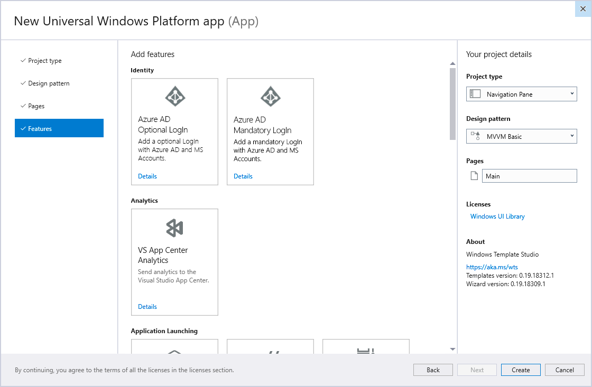
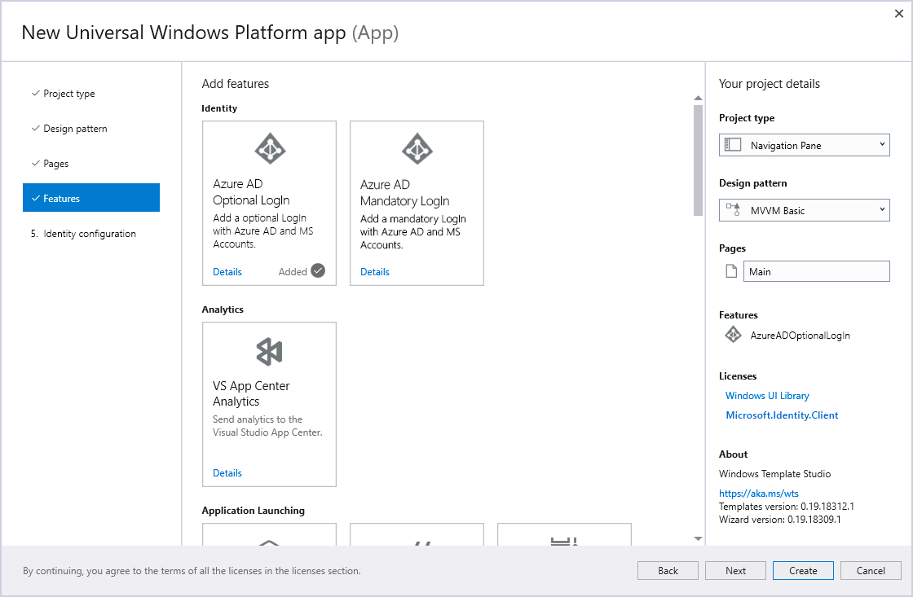
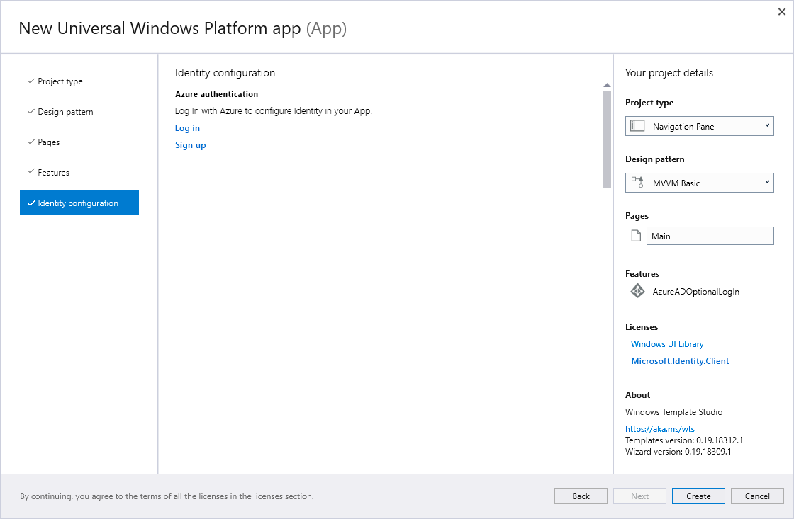
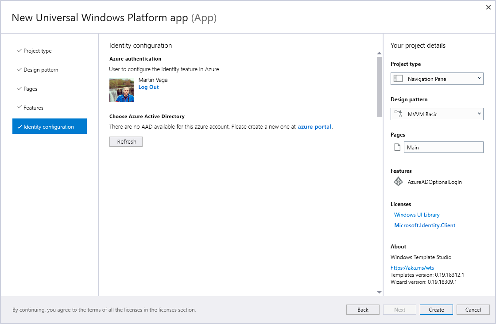
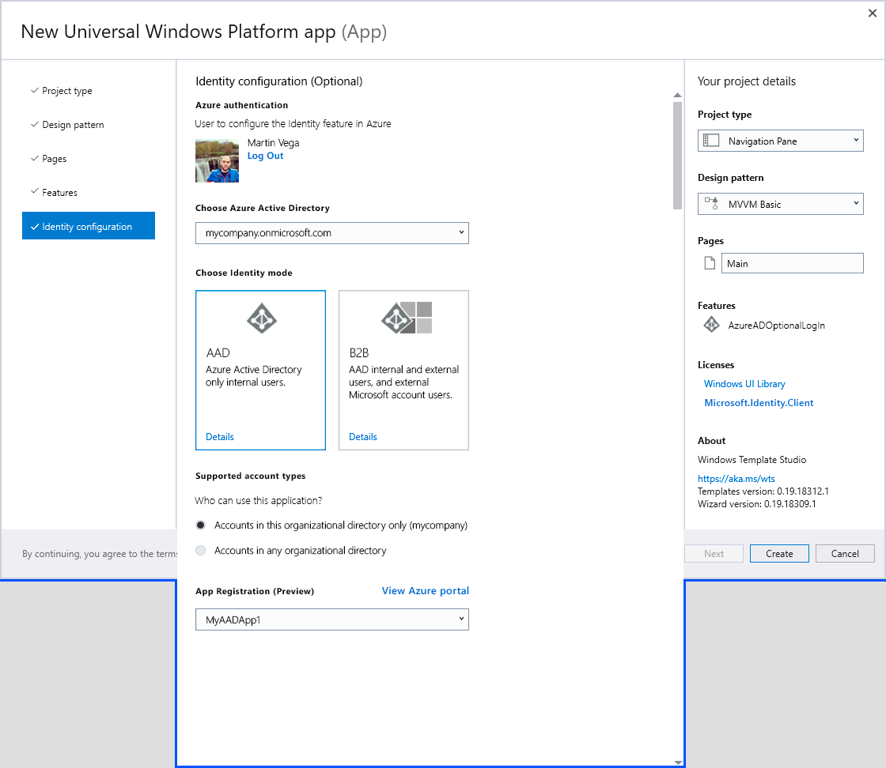
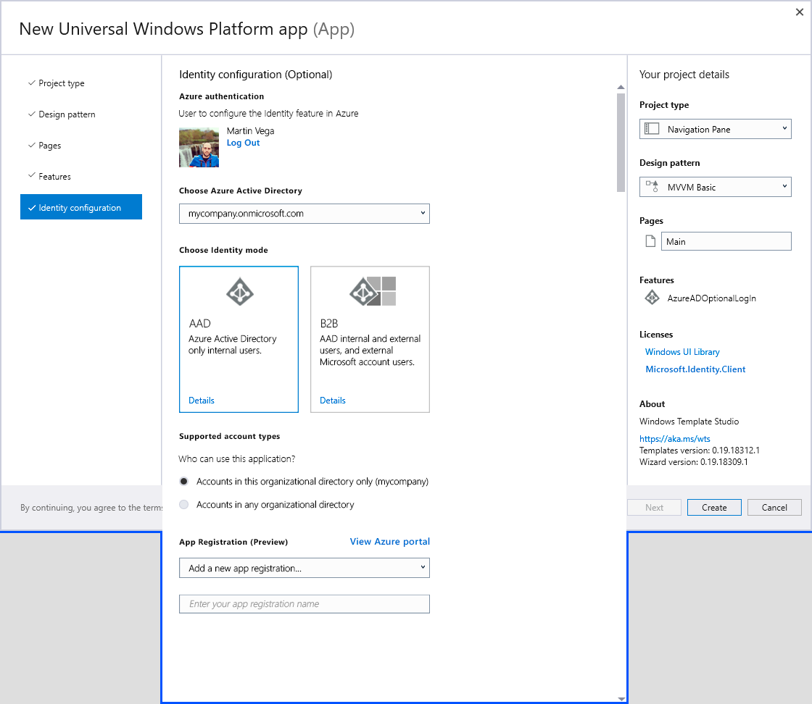
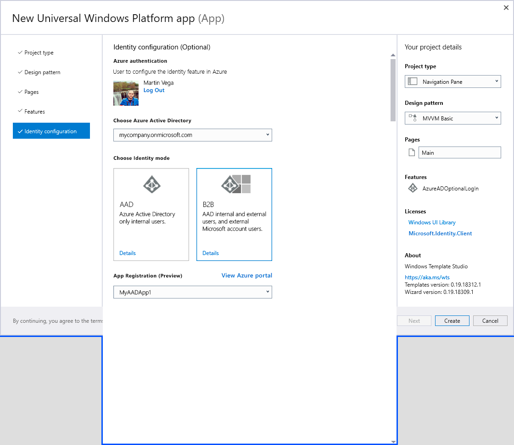

# Specs for Identity feature configuration in wizard

## Summary

The goal is adding two different features (optional and mandatory login) that allow developers to integrate authentication from the generated app.
The app will use [Microsoft Identity Platform v.2.0](https://docs.microsoft.com/azure/active-directory/develop/v2-overview) with the Microsoft Identity Client (MSAL) [nuget package](https://www.nuget.org/packages/Microsoft.Identity.Client/).
When a identity feature will be selected, a new step being available in Wizard to configure the identity with Azure Active Directory.

## Optional Login and Mandatory Login templates

### 1. Select feature

 - New Identity features category.
 - Two new login features, one for mandatory login in the app, one for optional login in the app. The difference between those two features is how the generated app will provide login/logout to the end user.
 - The two features must be mutually exclusive, if you add one you cannot add the other.

### 2. One of the identity features added

 - New step “Identity configuration” in wizard is added that allows to configure the identity feature selected.
 - Next button available.
 - Microsoft.Identity.Client (MSAL) license added.
 - At this point, if you choose to create (without configuring identity) we would generate the app with client_id set to xxxx and a TODO that tells you the steps necessary on Azure to create the application. The same thing happens if you do not finish the identity configuration explained below.
 
 ## Identity configuration

### 1. Azure Log In or Sign Up

 - If you click Log In, this will show a new pop-up window to log in with Azure.
 - If you click Sign up, this will open azure registration portal in a web browser.

### 2. Logged in but there is no Azure Subscriptions

 - Option to create a subscription on the azure portal.
 - Refresh button fetch for new subscriptions.
 - If you click on LogOut, this will log out and come back to login or singup page.

### 3.1 Chose AAD

 - First Azure Active directory selected by default.
 - Identity Mode AAD selected by default.
 - AAD allows two account types (this organization or any organizations).
 - App registrations in combobox will be filtered by the selected Azure Active Directory and account type.
 - To create a new app select Create New App Registration in the combobox.
 - If you choose AAD you could login using integrated auth from your app. We will not allow selection of integrated auth in the wizard but include a comment in the generated code to remove complexity on configuration time.

### 3.2 Create a new App Registration

 - Enter the app registration name.
 - Creation will happen when you hit Create on Wizard.

### 4. Chose B2B

 - Filtered by B2B Apps.
 - There are no subcategories in B2B. You have only to choose an app registration or create a new one.

